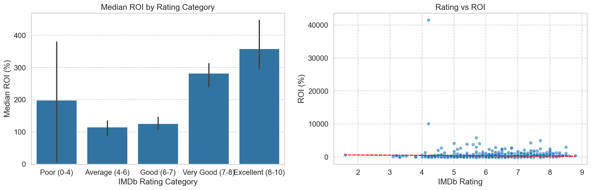

#  Strategic Film Investment Analysis

  

# Overview
This project conducts a comprehensive data analysis to guide our new movie studio's entry into the competitive film industry. By leveraging financial and audience data, the analysis identifies the most profitable genres, optimal budget ranges, and key success factors to minimize risk and maximize return on investment (ROI).

The entertainment landscape is dominated by established studios. This project mitigates the inherent risk of film production by replacing intuition with data-driven strategic decisions.

# Business Problem
The core challenge for the new studio is: "Which types of films perform best at the box office today?"
This is broken down into three key questions:

Genres: Which movie genres demonstrate the strongest and most consistent combination of high financial return (ROI) and audience appeal?

Budget: What is the optimal production budget range that maximizes ROI for a new entrant?

Strategy: What other factors—such as release season, runtime, or franchise potential—are correlated with success?

# Data Sources
The analysis synthesizes data from multiple sources to build a complete picture of a film's performance:

IMDb Database (im.db): Contains detailed information on movies, including genres, runtimes, average ratings, and number of votes.

The Numbers (tn.movie_budgets.csv.gz): Provides crucial production budget and worldwide gross revenue data, which is essential for calculating profitability and ROI.

# Tech Stack
Language: Python 3

Libraries: Pandas, NumPy, Matplotlib, Seaborn, SQLite3, Scikit-learn, Statsmodels

Environment: Jupyter Notebook

Key Techniques: Data Wrangling, SQL Querying, Exploratory Data Analysis (EDA), Data Visualization, Linear Regression, Statistical Diagnostics.

# Key Steps
Data Acquisition & Cleaning: Extracted and merged datasets from IMDb (via SQL) and The Numbers. Cleaned financial data (converted currency strings to integers) and handled missing values.

Exploratory Data Analysis (EDA): Analyzed distributions of ratings, votes, runtimes, and genres to understand the landscape of modern films.

Financial Metric Calculation: Created the primary KPI, Return on Investment (ROI), using the formula: ROI = ( (Worldwide Gross - Production Budget) / Production Budget ) * 100.

Genre Profitability Analysis: Split multi-genre films to accurately assess the average ROI for individual genres.

Budget vs. ROI Analysis: Categorized films into budget ranges to identify the most efficient investment level.

Statistical Modeling: Built a linear regression model to quantify the impact of budget, genre, and rating on ROI, followed by rigorous diagnosis of model assumptions.

# Key Findings & Strategic Recommendations

  

1. Genre Strategy: Focus on Horror, Mystery, and Thriller
Finding: These genres dominate in ROI efficiency. Horror films yielded an average ROI of over 1,050%, significantly higher than the median.

Recommendation: Prioritize Horror, Mystery, and Thriller films. They represent the optimal balance of moderate production costs and exceptional financial returns.

2. Budget Strategy: Target the $10-30 Million Range

  

Finding: A strong inverse relationship exists between budget and ROI. Films in the $10-30M budget category showed the highest median ROI (~185%) and a high success rate (62% of films achieved >100% ROI).

Recommendation: Structure productions within the $10-30 million budget range. This maximizes potential returns while allowing for a diversified portfolio to manage risk, unlike riskier blockbuster investments.

3. Quality Strategy: Aim for "Good" Ratings (6.0-7.0)

  

Finding: While higher-rated films (8.0+) have the highest median ROI, the correlation between rating and financial success is weak. Many films with "Good" ratings (6.0-7.0) are highly profitable.

Recommendation: Target a "Good" rating (6.0-7.0 on IMDb). Focus on commercial viability and audience entertainment within the chosen genres rather than overspending to chase critical acclaim.

# Conclusion
The synthesized strategy for a new movie studio is:

Produce Horror, Mystery, and Thriller films with budgets of $10-30 million, aiming for solid audience appeal (6.0-7.0 rating).

This data-driven approach provides a clear, actionable framework for launching a film studio designed to maximize financial efficiency and manage risk effectively.

